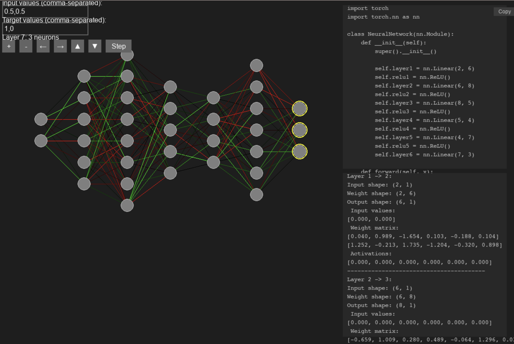

# Neural Network Visualizer

Interactive tool for visualizing and manipulating neural networks in real-time.


## Current Features
- Dynamic network architecture modification (add/remove layers and neurons)
- Live visualization of neuron activations and weight strengths
- Real-time PyTorch code generation
- Tensor operation visualization
- Keyboard and mouse controls
- Supervised learning with MSE loss

## Controls
- Arrow keys: Select and modify layers
- +/- buttons: Add/remove layers
- ▲/▼ buttons: Add/remove neurons
- T: Toggle tensor visualization
- Step/Enter: Run forward/backward pass

## Technical Details
- ReLU activation
- He weight initialization
- Gradient descent optimization
- Input format: comma-separated values matching layer dimensions

## Planned Features
- Autoencoder support
- Reinforcement learning capabilities
- Unsupervised learning modes
- Clustering visualization
- Alternative loss functions
- Policy/value network architectures
- Dimensionality reduction visualization

## Requirements
- Python 3.x
- PyGame
- NumPy
- Pyperclip

## Installation
```bash
pip install pygame numpy pyperclip
```